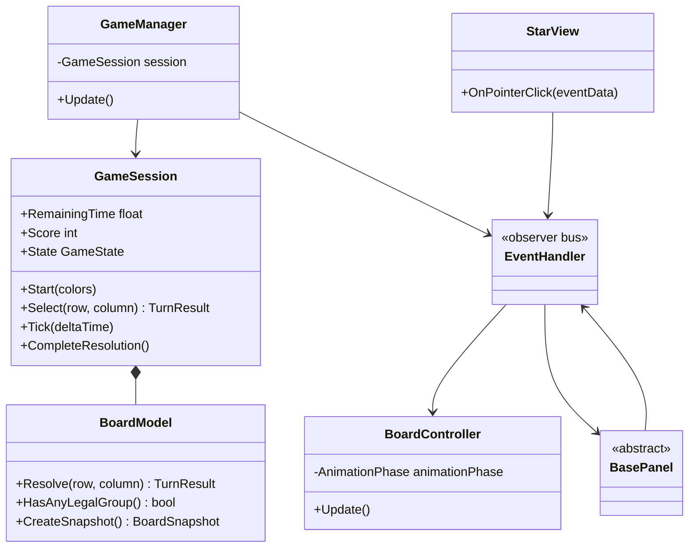
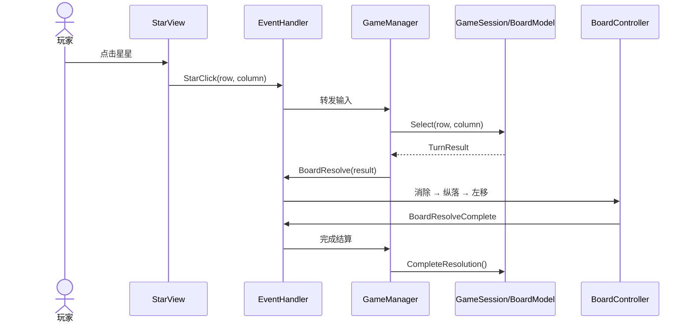

# 类图和时序图

项目已完成为“基于 `EventHandler` 观察者总线的事件驱动 MVC”。完整类职责、状态机、事件表、时序图和核心实现代码统一维护在同目录的 [项目架构.md](项目架构.md)。

```mermaid
classDiagram
    class BoardModel {
        +Resolve(row, column) TurnResult
        +HasAnyLegalGroup() bool
        +CreateSnapshot() BoardSnapshot
    }
    class GameSession {
        +RemainingTime float
        +Score int
        +State GameState
        +Start(colors)
        +Select(row, column) TurnResult
        +Tick(deltaTime)
        +CompleteResolution()
    }
    class GameManager {
        -GameSession session
        +Update()
    }
    class EventHandler {
        <<observer bus>>
    }
    class BoardController {
        -AnimationPhase animationPhase
        +Update()
    }
    class StarView {
        +OnPointerClick(eventData)
    }
    class BasePanel {
        <<abstract>>
    }

    GameSession *-- BoardModel
    GameManager --> GameSession
    GameManager --> EventHandler
    EventHandler --> BoardController
    EventHandler --> BasePanel
    StarView --> EventHandler
    BasePanel --> EventHandler
```

```mermaid
sequenceDiagram
    actor User as 玩家
    participant View as StarView
    participant Event as EventHandler
    participant GM as GameManager
    participant Model as GameSession/BoardModel
    participant Board as BoardController

    User->>View: 点击星星
    View->>Event: StarClick(row, column)
    Event->>GM: 转发输入
    GM->>Model: Select(row, column)
    Model-->>GM: TurnResult
    GM->>Event: BoardResolve(result)
    Event->>Board: 消除 → 纵落 → 左移
    Board->>Event: BoardResolveComplete
    Event->>GM: 完成结算
    GM->>Model: CompleteResolution()
```
