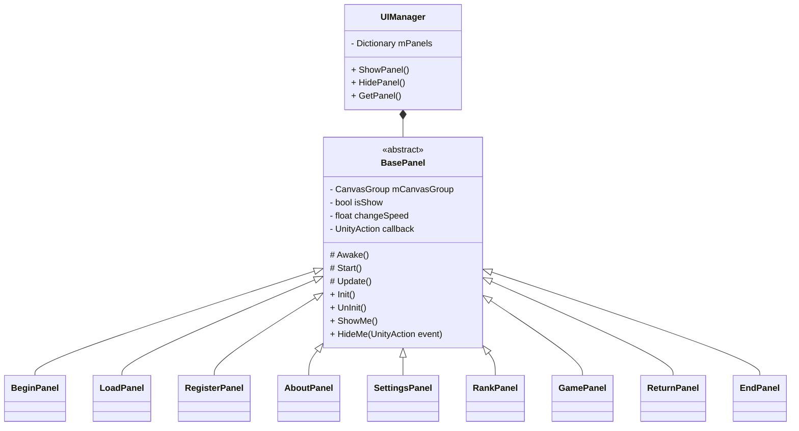
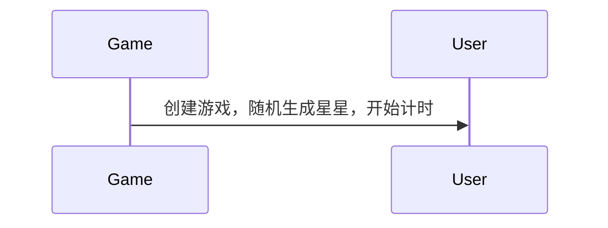
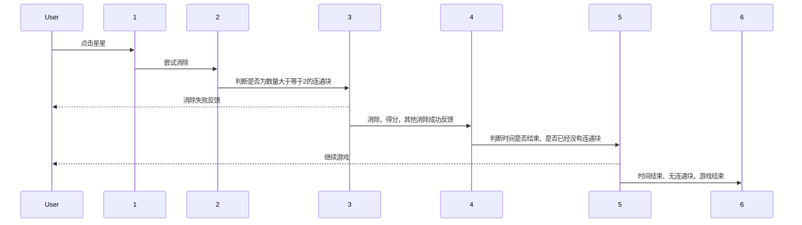

# 类图

```mermaid
classDiagram
class UIManager{
    - Dictionary<string,BasePanel> mPanels
    + ShowPanel()
    + HidePanel()
    + GetPanel()
}
class BasePanel{
    <<abstract>>
    - CanvasGroup mCanvasGroup
    - bool isShow
    - float changeSpeed
    - UnityAction callback
    # Awake()
    # Start()
    # Update()
    + Init()
    + UnInit()
    + ShowMe()
    + HideMe(UnityAction event)
}
class LoadPanel{

}
class RegisterPanel{

}
class BeginPanel{

}
class AboutPanel{

}
class SettingsPanel{

}
class RankPanel{

}
class GamePanel{

}
class ReturnPanel{

}
class EndPanel{

}
BasePanel <|-- BeginPanel
BasePanel <|-- LoadPanel
BasePanel <|-- RegisterPanel
BasePanel <|-- AboutPanel
BasePanel <|-- SettingsPanel
BasePanel <|-- RankPanel
BasePanel <|-- GamePanel
BasePanel <|-- ReturnPanel
BasePanel <|-- EndPanel
UIManager *-- BasePanel
```

## 时序图

```mermaid
sequenceDiagram
    Game->>User: 创建游戏，随机生成星星，开始计时
```

```mermaid
sequenceDiagram
    User->>1: 点击星星
    1->>2: 尝试消除
    2->>3: 判断是否为数量大于等于2的连通块
    3-->>User: 消除失败反馈
    3->>4: 消除，得分，其他消除成功反馈
    4->>5: 判断时间是否结束、是否已经没有连通块
    5-->>User: 继续游戏
    5->>6: 时间结束、无连通块，游戏结束
```
