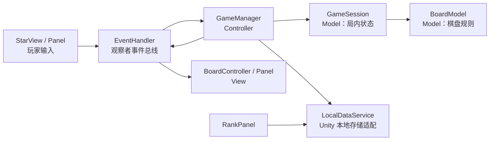
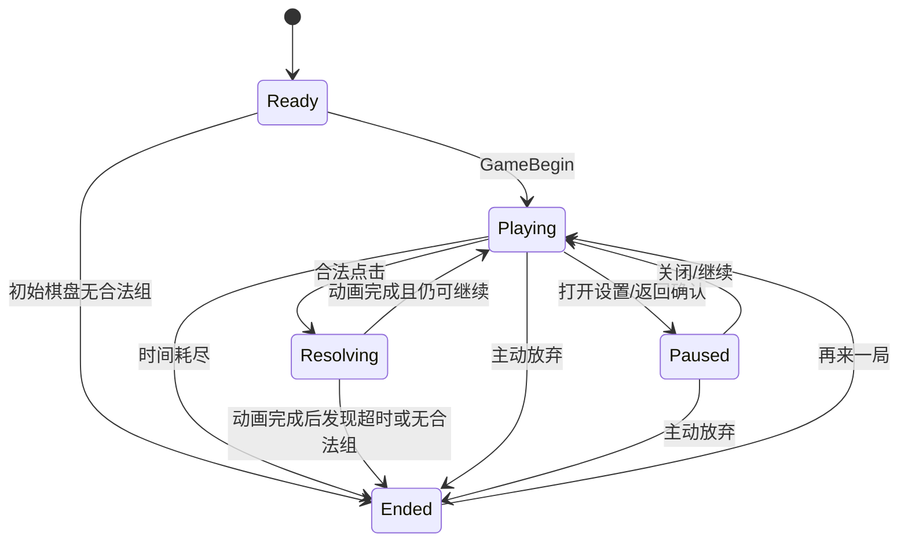
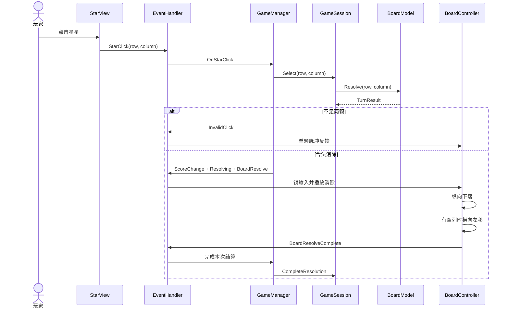

# 消灭星星：项目架构

## 1. 最终架构结论

本项目采用 **基于 `EventHandler` 观察者总线的事件驱动 MVC**。

它不是传统业务系统的“三层架构”，也没有额外引入观察者接口。现有 `EventHandler` 就是唯一的观察者模式实现：发送方发布事件，订阅方接收事件，双方不互相持有引用。



依赖方向固定为：

```text
View 输入 -> EventHandler -> GameManager -> GameSession -> BoardModel
Model 结果 -> GameManager -> EventHandler -> View 表现
```

`BoardModel` 和 `GameSession` 不引用 `UnityEngine`、`EventHandler`、`PlayerPrefs` 或任何 Panel，因此核心规则可以离开 Unity 单独编译和测试。

## 2. 保留的原有框架

以下底层代码按要求保持原样：

- `ResManager`：从 `Resources` 加载资源和实例化预制体。
- `UIManager`：创建、缓存、隐藏各类 Panel。
- `BasePanel`：Panel 的统一显示、隐藏和生命周期基类。
- 所有 Panel 仍继承 `BasePanel`，没有另建 UI 框架。

允许调整的 `EventHandler` 仍严格使用原项目格式：

```csharp
public static event Action<int, int> StarClickEvent;
public static void CallStarClickEvent(int row, int column)
{
    StarClickEvent?.Invoke(row, column);
}
```

没有新增 `IGameListener`、反射事件总线、依赖注入容器或其他重复结构。

## 3. 目录与职责

```text
Assets/Scripts
├─ Main.cs                         启动入口，先创建 GameManager，再显示 Begin/Load
├─ Game
│  ├─ Core
│  │  ├─ GameTypes.cs             枚举、棋盘快照、移动结果、回合结果
│  │  ├─ BoardModel.cs            连通、消除、纵压、左移、无解检测
│  │  └─ GameSession.cs           计时、分数、暂停、结算、结束状态
│  ├─ GameManager.cs              Controller，生成随机颜色并调度 Model/View
│  ├─ BoardController.cs          棋盘创建和分阶段动画
│  └─ StarView.cs                 单颗星星点击与非法点击反馈
├─ Tool
│  ├─ EventHandler.cs             唯一观察者事件总线
│  ├─ LocalDataService.cs         账号与排行榜 PlayerPrefs JSON
│  └─ ResManager.cs               原有资源管理器，未修改
└─ UI
   ├─ UIManager.cs                原有 UI 管理器，未修改
   ├─ BasePanel.cs                原有 Panel 基类，未修改
   └─ 各类 Panel                  登录、注册、首页、游戏、设置、排行、结算等
```

### Model

- `BoardModel` 只处理棋盘事实，不播放动画、不发事件。
- `GameSession` 只管理一局游戏的时间、分数和状态。
- `TurnResult` 一次性返回被消除星星、纵向移动、横向移动、得分和最终棋盘。

### Controller

- `GameManager` 使用 `Random.Range(0, 5)` 生成 100 个颜色值。
- 同步调用 `GameSession`，再通过 `EventHandler` 发布强类型结果。
- 只在正常结束时写入排行榜；主动放弃不记录。

### View

- `StarView` 只上报自己的行列，不判断能否消除。
- `BoardController` 只消费 Model 已算好的 `TurnResult` 并播放表现。
- Panel 只负责按钮、文字、面板切换和事件订阅。

## 4. 已实现的规则

| 项目 | 当前实现 |
|---|---|
| 棋盘 | 固定 10 × 10 |
| 颜色 | `Star1`～`Star5`，`Random.Range(0, 5)` 简单随机 |
| 连通 | 仅上下左右，斜角不算 |
| 合法消除 | 同色连通数量至少为 2 |
| 得分 | 每次 `5 × 数量²` |
| 移动顺序 | 先纵向压缩，再把非空列保持原顺序整体左移 |
| 连锁 | 已取消；移动形成的新组等待下一次点击 |
| 单局时间 | 120 秒 |
| 结束条件 | 时间耗尽，或稳定棋盘没有合法连通块 |
| 动画期 | 时间继续，棋盘、设置、返回输入锁定 |
| 动画期超时 | 当前消除、纵压、左移全部完成后再结束 |
| 主动放弃 | 返回首页，不写入排行榜 |

## 5. 状态机



状态职责：

- `Playing`：接受星星点击，计时。
- `Resolving`：播放消除和移动，继续计时，但拒绝新输入。
- `Paused`：停止计时，拒绝棋盘输入。
- `Ended`：本局不可再操作。

## 6. 一次点击的完整时序



## 7. EventHandler 事件表

| 事件 | 发送方 | 主要订阅方 | 用途 |
|---|---|---|---|
| `GameBeginEvent` | `BeginPanel` / `EndPanel` | `GameManager` | 开始或重开一局 |
| `TimeChangeEvent` | `GameManager` | `GamePanel` | 更新时间条 |
| `StopTimeEvent` | `GamePanel` / 弹窗 | `GameManager` | 暂停或恢复 |
| `BoardCreateEvent` | `GameManager` | `BoardController` | 创建初始棋盘 |
| `StarClickEvent` | `StarView` | `GameManager` | 上报点击坐标 |
| `InvalidClickEvent` | `GameManager` | `BoardController` | 非法点击反馈 |
| `BoardResolveEvent` | `GameManager` | `BoardController` | 播放一次结算动画 |
| `BoardResolveCompleteEvent` | `BoardController` | `GameManager` | 表现层完成动画 |
| `ScoreChangeEvent` | `GameManager` | `GamePanel` | 更新总分 |
| `GameStateChangeEvent` | `GameManager` | `BoardController` / `GamePanel` | 输入锁与按钮状态 |
| `GameEndEvent` | `GameManager` | `GamePanel` | 显示正常结算面板 |
| `GameAbortEvent` | `ReturnPanel` | `GameManager` | 主动放弃 |

## 8. 核心实现代码

以下代码是当前项目源码中的核心逻辑，不是伪代码。

### 8.1 一次消除的规则入口

`BoardModel.Resolve` 只结算玩家本次点击，不继续查找并自动消除新组，因此没有连锁。

```csharp
public TurnResult Resolve(int row, int column)
{
    if (!IsInside(row, column))
    {
        return TurnResult.Invalid(CreateSnapshot());
    }

    StarData selected = grid[row, column];

    if (selected.IsEmpty)
    {
        return TurnResult.Invalid(CreateSnapshot());
    }

    List<StarData> group = FindConnectedGroup(row, column);

    if (group.Count < 2)
    {
        return TurnResult.Invalid(CreateSnapshot());
    }

    Remove(group);
    StarMove[] verticalMoves = CompressVertically();
    StarMove[] horizontalMoves = ShiftColumnsLeft();

    return TurnResult.Valid(
        group.ToArray(),
        verticalMoves,
        horizontalMoves,
        CreateSnapshot());
}
```

得分在合法结果创建时计算：

```csharp
public static TurnResult Valid(
    StarData[] removedStars,
    StarMove[] verticalMoves,
    StarMove[] horizontalMoves,
    BoardSnapshot board)
{
    int count = removedStars.Length;
    int scoreDelta = 5 * count * count;
    return new TurnResult(true, removedStars, verticalMoves, horizontalMoves, scoreDelta, board);
}
```

### 8.2 上下左右 BFS 连通检测

```csharp
private static readonly int[] RowDirections = { -1, 1, 0, 0 };
private static readonly int[] ColumnDirections = { 0, 0, -1, 1 };

private List<StarData> FindConnectedGroup(int startRow, int startColumn)
{
    StarColor color = grid[startRow, startColumn].Color;
    bool[,] visited = new bool[RowCount, ColumnCount];
    Queue<int> pending = new Queue<int>();
    List<StarData> group = new List<StarData>();

    pending.Enqueue(startRow * ColumnCount + startColumn);
    visited[startRow, startColumn] = true;

    while (pending.Count > 0)
    {
        int index = pending.Dequeue();
        int row = index / ColumnCount;
        int column = index % ColumnCount;
        group.Add(grid[row, column]);

        for (int direction = 0; direction < RowDirections.Length; direction++)
        {
            int nextRow = row + RowDirections[direction];
            int nextColumn = column + ColumnDirections[direction];

            if (!IsInside(nextRow, nextColumn) || visited[nextRow, nextColumn])
            {
                continue;
            }

            if (grid[nextRow, nextColumn].Color != color)
            {
                continue;
            }

            visited[nextRow, nextColumn] = true;
            pending.Enqueue(nextRow * ColumnCount + nextColumn);
        }
    }

    return group;
}
```

### 8.3 纵向压缩

每一列从底部向上读取，用 `writeRow` 指向当前应该落到的位置。只有位置变化的星星才生成 `StarMove`，供表现层播放动画。

```csharp
private StarMove[] CompressVertically()
{
    List<StarMove> moves = new List<StarMove>();

    for (int column = 0; column < ColumnCount; column++)
    {
        int writeRow = RowCount - 1;

        for (int readRow = RowCount - 1; readRow >= 0; readRow--)
        {
            StarData star = grid[readRow, column];

            if (star.IsEmpty)
            {
                continue;
            }

            if (readRow != writeRow)
            {
                grid[writeRow, column] = star.MoveTo(writeRow, column);
                grid[readRow, column] = StarData.CreateEmpty(readRow, column);
                moves.Add(new StarMove(star.Id, readRow, column, writeRow, column));
            }

            writeRow--;
        }

        for (int row = writeRow; row >= 0; row--)
        {
            grid[row, column] = StarData.CreateEmpty(row, column);
        }
    }

    return moves.ToArray();
}
```

### 8.4 空列左移

`writeColumn` 始终指向下一个非空列应写入的位置，因此非空列的相对顺序不会变化。

```csharp
private StarMove[] ShiftColumnsLeft()
{
    List<StarMove> moves = new List<StarMove>();
    int writeColumn = 0;

    for (int readColumn = 0; readColumn < ColumnCount; readColumn++)
    {
        if (IsColumnEmpty(readColumn))
        {
            continue;
        }

        if (readColumn != writeColumn)
        {
            MoveColumn(readColumn, writeColumn, moves);
        }

        writeColumn++;
    }

    for (int column = writeColumn; column < ColumnCount; column++)
    {
        for (int row = 0; row < RowCount; row++)
        {
            grid[row, column] = StarData.CreateEmpty(row, column);
        }
    }

    return moves.ToArray();
}
```

### 8.5 动画期间继续计时，超时延迟结算

`Tick` 同时允许 `Playing` 和 `Resolving` 扣时间，但只有 `Playing` 会立即结束。若在 `Resolving` 期间归零，等 `CompleteResolution` 被动画层调用后才结束。

```csharp
public void Tick(float deltaTime)
{
    if (State != GameState.Playing && State != GameState.Resolving)
    {
        return;
    }

    if (deltaTime <= 0f)
    {
        return;
    }

    RemainingTime = Math.Max(0f, RemainingTime - deltaTime);

    if (RemainingTime <= 0f && State == GameState.Playing)
    {
        End(GameEndReason.TimeExpired);
    }
}

public void CompleteResolution()
{
    if (State != GameState.Resolving)
    {
        return;
    }

    if (RemainingTime <= 0f)
    {
        End(GameEndReason.TimeExpired);
        return;
    }

    if (!Board.HasAnyLegalGroup())
    {
        End(GameEndReason.NoLegalGroup);
        return;
    }

    State = GameState.Playing;
}
```

### 8.6 Controller 不直接处理棋盘细节

```csharp
private void OnStarClickEvent(int row, int column)
{
    if (session.State != GameState.Playing)
        return;

    TurnResult result = session.Select(row, column);
    if (!result.IsValid)
    {
        EventHandler.CallInvalidClickEvent(row, column);
        return;
    }

    EventHandler.CallScoreChangeEvent(session.Score);
    EventHandler.CallGameStateChangeEvent(session.State);
    EventHandler.CallBoardResolveEvent(result);
}
```

### 8.7 表现层严格按三个阶段播放

```csharp
private void Update()
{
    switch (animationPhase)
    {
        case AnimationPhase.Removing:
            UpdateRemoving();
            return;
        case AnimationPhase.VerticalFall:
            UpdateMoving(verticalFallDuration);
            return;
        case AnimationPhase.HorizontalShift:
            UpdateMoving(horizontalShiftDuration);
            return;
    }
}

private void BeginVerticalFall()
{
    BuildMoveAnimations(resolvingResult.VerticalMoves);

    if (moveAnimations.Count == 0)
    {
        BeginHorizontalShift();
        return;
    }

    phaseTime = 0f;
    animationPhase = AnimationPhase.VerticalFall;
}

private void BeginHorizontalShift()
{
    BuildMoveAnimations(resolvingResult.HorizontalMoves);

    if (moveAnimations.Count == 0)
    {
        CompleteResolution();
        return;
    }

    phaseTime = 0f;
    animationPhase = AnimationPhase.HorizontalShift;
}
```

没有使用协程或 `Task`；动画由 `Update` 状态机驱动。

## 9. 登录与注册

启动流程固定为：

```text
Main
├─ 创建 GameManager
├─ 显示 BeginPanel（底层）
└─ 显示 LoadPanel（覆盖层）
```

- 每次启动都显示登录面板。
- 用户名、密码必须非空且只能包含 ASCII 字母或数字。
- 用户名和密码区分大小写、精确匹配。
- 支持多个本地账号。
- 注册检查账号是否已经存在。
- 注册成功返回 `LoadPanel`，用户重新登录。
- 密码按要求以明文保存在本机 PlayerPrefs JSON 中。
- 账号只用于登录演示，不参与游戏和排行榜。

账号键与排行键彼此独立：

```text
EliminateStar.Accounts
EliminateStar.Ranks
```

## 10. 排行榜

- 数据来自本机 PlayerPrefs，与登录账号无关。
- 正常结束写入；主动放弃不写入。
- 分数降序；同分按记录时间升序，即更早的记录排在前面。
- 只保留前 20 条。
- 显示格式：`yyyy年MM月dd日HH:mm`。
- 条目实例化到 `RankPanel/Scroll View/Viewport/Content`。
- 第一至第三名依次使用 `Sprite/NumberOne`、`NumberTwo`、`NumberThree`，其余使用 `Other`。
- 排行条目预制体为 `Resources/Prefabs/Rank.prefab`。

## 11. UI 与资源约定

- 分辨率固定为 1080 × 1920 竖屏。
- 构建场景已指向 `Assets/Scenes/MainScene.unity`。
- Panel 资源继续位于 `Resources/UI`。
- 星星和排行条目位于 `Resources/Prefabs`。
- 排行图片位于 `Resources/Sprite`。
- 所有代码中的资源路径均通过 `Path.Combine` 构造。
- `GamePanel` 的 `score`、`RegisterPanel` 的两个输入框、`RankPanel` 的 `Content` 已完成预制体序列化绑定。

## 12. 验证结果

纯 C# 核心冒烟测试覆盖：

- 2 颗消除得到 20 分。
- 10 颗消除得到 500 分。
- 无空列时只发生纵向压缩。
- 出现空列时剩余列保持顺序整体左移。
- `Resolving` 期间继续计时。
- `Resolving` 期间超时会等本次动画完成后结束。
- 稳定棋盘无合法组时结束。
- `Paused` 期间不计时。

完整脚本使用 Unity 2021.2.18f1 的项目引用编译：**0 个错误，0 个警告**。

## 13. 当前刻意保留的边界

- 音乐、音效、视频、SpriteAtlas 和额外动画按要求暂不实现。
- `SettingPanel` 只保留测试用控件回调。
- `BasePanel`、`UIManager`、`ResManager` 按要求未改动。
- 原 `BasePanel` 的隐藏回调会在淡出过程第一帧执行，因此当前实际表现接近立即销毁。它不影响功能流程；如果以后允许调整底层，可把回调限制为透明度到 0 后仅执行一次。
